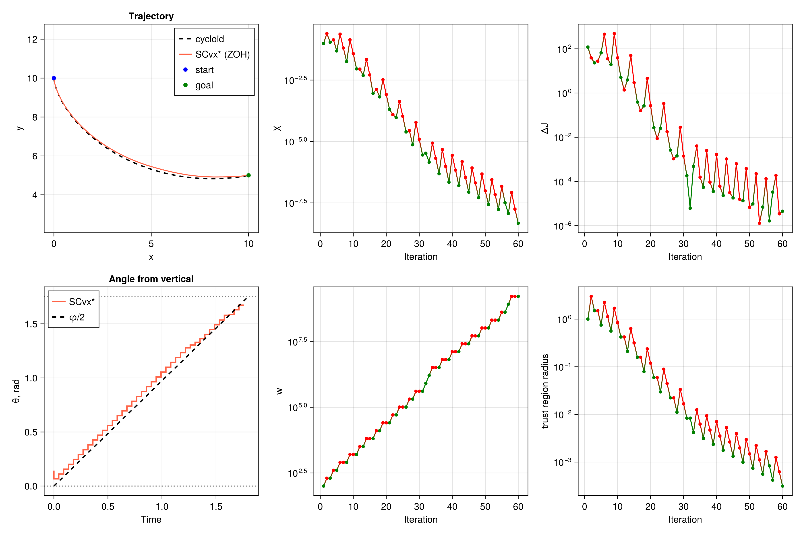

# Brachistochrone

Brachistochrone problem: finding the fastest descent path.

This classic calculus of variations problem finds the curve of fastest descent between two points under gravity. The solution demonstrates time-optimal trajectory generation with:

* 2D position dynamics
* Speed dynamics under gravitational acceleration
* Angle control subject to bounds
* Minimal time objective

The state is ``[x, y, v]`` and the control is the angle ``\theta`` from the downward vertical. Final time is free on a uniform grid: normalized time runs over ``[0, 1]``, and a dilation ``s = t_f`` scales the dynamics. The propagated trajectory is compared with the analytical cycloid.

**File:** `examples/brachistochrone/ex_scvxstar_brachistochrone.jl`

```julia
"""Brachistochrone minimum-time problem with SCvx*

Classic fastest-descent curve from the OpenSCvx brachistochrone example:
https://openscvx.github.io/OpenSCvx/latest/Examples/abstract/brachistochrone/

The final time is free. Normalized time τ ∈ [0, 1] and a uniform dilation
control s = tf give dx/dτ = s f(x, θ).
"""

using Clarabel
using ForwardDiff
using CairoMakie
using JuMP
using LinearAlgebra
using OrdinaryDiffEq

include(joinpath(@__DIR__, "../../src/SCPLib.jl"))


# -------------------- setup problem -------------------- #
struct BrachistochroneParams
    g::Float64
end

g = 9.81
params = BrachistochroneParams(g)

function eom!(dx, x, pu, t)
    (; params, u) = pu
    θ = u[1]
    s = u[2]
    v = x[3]
    dx[1] =  s * v * sin(θ)
    dx[2] = -s * v * cos(θ)
    dx[3] =  s * params.g * cos(θ)
    return
end

# boundary conditions and bounds (OpenSCvx brachistochrone)
x_initial = [0.0, 10.0, 0.0]
xy_final = [10.0, 5.0]
pos_min = 0.0
pos_max = 10.0
v_min = 0.0
v_max = 10.0
theta_min = 0.0
theta_max = 100.5 * π / 180
tf_min = 1e-2          # open lower bound; s = 0 makes the dilation singular
tf_max = 2.0
tf_guess = 2.0

# analytical cycloid: X = r (φ - sin φ), Y = r (1 - cos φ), Y measured downward
# (φf - sin φf) / (1 - cos φf) = Xf / Yf,  T = φf * sqrt(r / g),  θ = φ / 2
function cycloid_parameters(Xf, Yf, g)
    ratio = Xf / Yf
    φ = 2.5
    for _ in 1:30
        f = φ - sin(φ) - ratio * (1 - cos(φ))
        df = 1 - cos(φ) - ratio * sin(φ)
        φ -= f / df
    end
    r = Yf / (1 - cos(φ))
    T = φ * sqrt(r / g)
    return φ, r, T
end

Xf = xy_final[1] - x_initial[1]
Yf = x_initial[2] - xy_final[2]
φf, r_cyc, T_cyc = cycloid_parameters(Xf, Yf, g)

# -------------------- define objective -------------------- #
function objective(x, u)
    return u[2, 1]     # uniform dilation; s = tf
end

# -------------------- create problem -------------------- #
N = 41
nx = 3                              # [x, y, v]
nu = 2                              # [θ, s]
times = LinRange(0.0, 1.0, N)

v_final_guess = sqrt(2 * g * Yf)
x_final_guess = [xy_final; v_final_guess]
x_ref = zeros(nx, N)
for (i, α) in enumerate(LinRange(0.0, 1.0, N))
    x_ref[:, i] = (1 - α) * x_initial + α * x_final_guess
end
θ_guess = collect(LinRange(5 * π / 180, theta_max, N - 1))
u_ref = [θ_guess'; tf_guess * ones(1, N - 1)]

prob = SCPLib.ContinuousProblem(
    Clarabel.Optimizer,
    eom!,
    params,
    objective,
    times,
    x_ref,
    u_ref;
    ode_method = Tsit5(),
)
set_silent(prob.model)

# boundary conditions; final speed is free inside its box
@constraint(prob.model, constraint_initial, prob.model[:x][:, 1] == x_initial)
@constraint(prob.model, constraint_final_xy, prob.model[:x][1:2, end] == xy_final)

# convex path constraints
@constraint(prob.model, constraint_position_lb[i in 1:2, k in 1:N],
    prob.model[:x][i, k] >= pos_min)
@constraint(prob.model, constraint_position_ub[i in 1:2, k in 1:N],
    prob.model[:x][i, k] <= pos_max)
@constraint(prob.model, constraint_speed_lb[k in 1:N],
    prob.model[:x][3, k] >= v_min)
@constraint(prob.model, constraint_speed_ub[k in 1:N],
    prob.model[:x][3, k] <= v_max)
@constraint(prob.model, constraint_theta_lb[k in 1:N-1],
    prob.model[:u][1, k] >= theta_min)
@constraint(prob.model, constraint_theta_ub[k in 1:N-1],
    prob.model[:u][1, k] <= theta_max)

# uniform free final time
@constraint(prob.model, constraint_tf_lb[k in 1:N-1], prob.model[:u][2, k] >= tf_min)
@constraint(prob.model, constraint_tf_ub[k in 1:N-1], prob.model[:u][2, k] <= tf_max)
@constraint(prob.model, constraint_tf_uniform[k in 1:N-2],
    prob.model[:u][2, k] == prob.model[:u][2, k+1])


# -------------------- instantiate algorithm -------------------- #
# Trust region on (θ, s): those controls enter the dynamics nonlinearly,
# and unbounded control steps stall the linear model at tf = tf_max.
algo = SCPLib.SCvxStar(
    nx, N;
    w0 = 1e2,
    Δ0 = 1.0,
    nu = nu,
    Δ0_u = 0.5,
    use_trustregion_control = true,
)

solution = SCPLib.solve!(algo, prob, x_ref, u_ref; maxiter = 200, tol_feas = 1e-8, tol_opt = 1e-4)

# propagate solution
sols_opt, g_dynamics_opt = SCPLib.get_trajectory(prob, solution.x, solution.u)
tf = solution.u[2, 1]

# -------------------- plot -------------------- #
fig = Figure(size=(1200, 800))

φs = LinRange(0.0, φf, 400)
x_cyc = x_initial[1] .+ r_cyc .* (φs .- sin.(φs))
y_cyc = x_initial[2] .- r_cyc .* (1 .- cos.(φs))

ax_xy = Axis(fig[1, 1]; xlabel = "x", ylabel = "y", title = "Trajectory", autolimitaspect = 1)
lines!(ax_xy, x_cyc, y_cyc, color = :black, linestyle = :dash, linewidth = 2, label = "cycloid")
for (i, _sol) in enumerate(sols_opt)
    lines!(ax_xy, Array(_sol)[1, :], Array(_sol)[2, :], color = :tomato; label = i == 1 ? "SCvx* (ZOH)" : nothing)
end
scatter!(ax_xy, [x_initial[1]], [x_initial[2]], color = :blue, label = "start")
scatter!(ax_xy, [xy_final[1]], [xy_final[2]], color = :green, label = "goal")
axislegend(ax_xy, position = :rt)

ax_θ = Axis(fig[2, 1]; xlabel = "Time", ylabel = "θ, rad", title = "Angle from vertical")
t_nodes = prob.times .* tf
t_dense = LinRange(0.0, T_cyc, 400)
stairs!(ax_θ, t_nodes[1:end-1], solution.u[1, :], step = :pre, color = :tomato, linewidth = 2, label = "SCvx*")
lines!(ax_θ, t_dense, t_dense ./ (2 * sqrt(r_cyc / g)), color = :black, linestyle = :dash, linewidth = 2, label = "φ/2")
hlines!(ax_θ, [theta_min, theta_max], color = :gray, linestyle = :dot)
axislegend(ax_θ, position = :lt)

colors_accept = [solution.info[:accept][i] ? :green : :red for i in 1:length(solution.info[:accept])]
ax_χ = Axis(fig[1, 2]; xlabel = "Iteration", ylabel = "χ", yscale = log10)
scatterlines!(ax_χ, 1:length(solution.info[:accept]), solution.info[:χ], color = colors_accept, marker = :circle, markersize = 7)

ax_w = Axis(fig[2, 2]; xlabel = "Iteration", ylabel = "w", yscale = log10)
scatterlines!(ax_w, 1:length(solution.info[:accept]), solution.info[:w], color = colors_accept, marker = :circle, markersize = 7)

ax_J = Axis(fig[1, 3]; xlabel = "Iteration", ylabel = "ΔJ", yscale = log10)
scatterlines!(ax_J, 1:length(solution.info[:accept]), abs.(solution.info[:ΔJ]), color = colors_accept, marker = :circle, markersize = 7)

ax_Δ = Axis(fig[2, 3]; xlabel = "Iteration", ylabel = "trust region radius", yscale = log10)
scatterlines!(ax_Δ, 1:length(solution.info[:accept]), [minimum(val) for val in solution.info[:Δ]], color = colors_accept, marker = :circle, markersize = 7)

mkpath(joinpath(@__DIR__, "plots"))
save(joinpath(@__DIR__, "plots/brachistochrone_traj_scvxstar.png"), fig; px_per_unit = 3)
display(fig)
println("Cycloid time T = $(T_cyc) s, optimized time tf = $(tf) s")
println("|tf - T| = $(abs(tf - T_cyc)) s")
println("Terminal cycloid angle φf/2 = $(rad2deg(φf / 2)) deg (bound $(rad2deg(theta_max)) deg)")
println("Dynamics defect ‖g‖∞ = $(norm(g_dynamics_opt, Inf))")
println("Done!")
```


