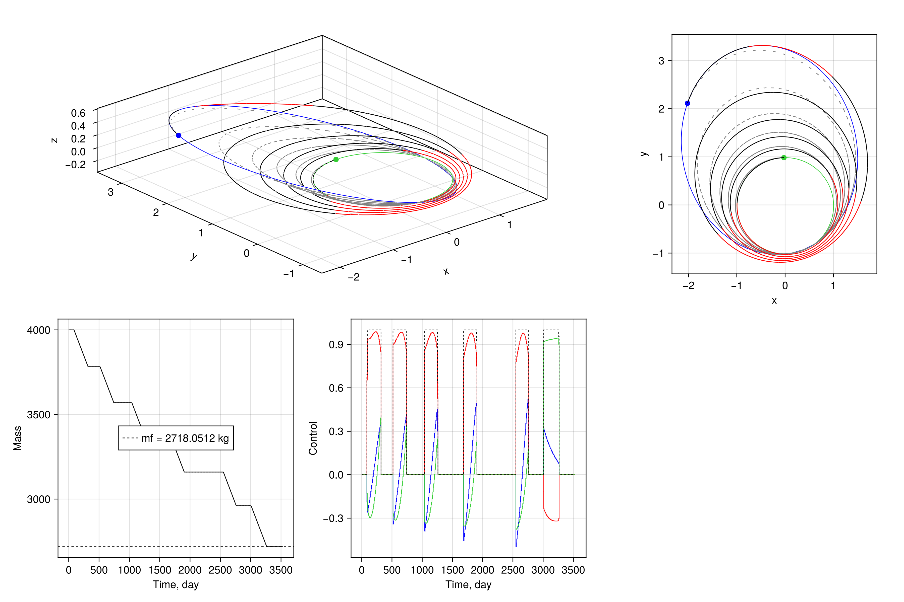

# Dionysus transfer

Low-thrust heliocentric rendezvous with asteroid Dionysus: maximum final mass at a fixed time of flight.

A spacecraft flies from a prescribed Earth-departure state to the asteroid under constant specific impulse. The solve uses modified equinoctial elements so the coasting dynamics stay nonsingular, and demonstrates:

* Gauss variational equations with thrust in the radial–transverse–normal frame
* A throttle and a thrust-direction cone
* A fixed time of flight on a uniform grid
* A nonconvex Cartesian rendezvous, with final mass free
* Maximum-final-mass objective

**File:** `examples_astrodynamics/example_dionysus.jl`

Note: this example requires [AstrodynamicsCore.jl](https://github.com/eXplorationLogisticsControl/AstrodynamicsCore.jl).

## Dynamics

The state is the modified equinoctial elements and the mass normalized by the initial mass,

```math
\boldsymbol{x} = [p,\, f,\, g,\, h,\, k,\, L,\, m]^\top.
```

Here $p$ is the semi-latus rectum, $(f, g)$ and $(h, k)$ are the equinoctial components of eccentricity and inclination, $L$ is the true longitude, and $m(0) = 1$ corresponds to $4000\,\mathrm{kg}$. The control is the thrust direction in the radial–transverse–normal frame together with the throttle,

```math
\boldsymbol{u} = [u_r,\, u_\theta,\, u_n,\, \Gamma]^\top.
```

Let $\mu$ be the Sun's gravitational parameter and

```math
w = 1 + f\cos L + g\sin L, \qquad s^2 = 1 + h^2 + k^2.
```

Full thrust at unit mass has canonical acceleration $c_1$. The applied acceleration is

```math
\boldsymbol{a} = \frac{c_1}{m}\,[u_r,\, u_\theta,\, u_n]^\top,
```

and the Gauss equations are

```math
\begin{aligned}
\dot p &= \sqrt{\frac{p}{\mu}}\,\frac{2p}{w}\, a_\theta, \\[0.4em]
\dot f &= \sqrt{\frac{p}{\mu}}\Biggl[
    \sin L\, a_r + \frac{(1+w)\cos L + f}{w}\, a_\theta
    - \frac{g}{w}(h\sin L - k\cos L)\, a_n
\Biggr], \\[0.4em]
\dot g &= \sqrt{\frac{p}{\mu}}\Biggl[
    -\cos L\, a_r + \frac{(1+w)\sin L + g}{w}\, a_\theta
    + \frac{f}{w}(h\sin L - k\cos L)\, a_n
\Biggr], \\[0.4em]
\dot h &= \sqrt{\frac{p}{\mu}}\,\frac{s^2 \cos L}{2w}\, a_n, \\[0.4em]
\dot k &= \sqrt{\frac{p}{\mu}}\,\frac{s^2 \sin L}{2w}\, a_n, \\[0.4em]
\dot L &= \sqrt{\frac{p}{\mu}}\,\frac{h\sin L - k\cos L}{w}\, a_n
    + \sqrt{\frac{\mu}{p^3}}\, w^2, \\[0.4em]
\dot m &= -c_2 \Gamma.
\end{aligned}
```

The last term in $\dot L$ is the Keplerian mean motion. The mass-flow constant $c_2$ is the canonical rate at full throttle. In matrix form this is

```math
\dot{\boldsymbol{x}}_{[1:6]} = B(\boldsymbol{x})\,(c_1/m)\,\boldsymbol{u}_{[1:3]} + \boldsymbol{D}(\boldsymbol{x})
```

with $\boldsymbol{D} = [0,0,0,0,0,\sqrt{\mu/p^3}\,w^2]^\top$, and $B$ matrix defined accordingly.

Length is scaled by $1\,\mathrm{AU} = 149.6\times 10^6\,\mathrm{km}$, so $\mu = 1$. Time and velocity follow from the solar gravitational parameter. Thrust is $0.32\,\mathrm{N}$ and $I_\mathrm{sp} = 3000\,\mathrm{s}$.

## Boundary conditions

Time of flight is fixed at $3534$ days. The node times are a uniform grid on $[0, t_f]$, and the control is zero-order hold.

**Fixed**

* Initial state, including mass: $\boldsymbol{x}(0) = [\mathrm{mee}(\boldsymbol{r}_0, \boldsymbol{v}_0)^\top,\, 1]^\top$, with $(\boldsymbol{r}_0, \boldsymbol{v}_0)$ the prescribed heliocentric departure state.
* Terminal Cartesian state. Six nonconvex equalities enforce $\mathrm{rv}(p, f, g, h, k, L)\big|_{t_f} = (\boldsymbol{r}_f, \boldsymbol{v}_f)$.
* Thrust cone, at every interval: $\|(u_r, u_\theta, u_n)\|_2 \le \Gamma \le 1$.
* Path bounds $p(t) \ge 0.8$ and $m(t) \ge 0.1$, in canonical units.

The arrival state $(\boldsymbol{r}_f, \boldsymbol{v}_f)$ is the target Keplerian orbit propagated to the fixed arrival epoch,

```math
a = 2.2\,\mathrm{AU},\quad
e = 0.542,\quad
i = 13.6^\circ,\quad
\Omega = 82.2^\circ,\quad
\omega = 204.2^\circ,\quad
M = 114.4232^\circ.
```

**Free**

* Final mass. The objective is $\min\; -m(t_f)$, so the solve maximizes the mass that remains.
* Thrust direction and throttle along the transfer.
* Terminal equinoctial elements. The Cartesian rendezvous is the constraint that is enforced; $L$ is $2\pi$-periodic in that map. The reference trajectory appends $N_\mathrm{rev} = 5$ revolutions to the guessed terminal true longitude and linearly interpolates mass from $1$ down to $0.4$. That terminal mass is only a guess.

```julia
"""Sample SCP problem with MEE"""

using Base.Threads
using Clarabel
using GLMakie
using JuMP
using LinearAlgebra
using OrdinaryDiffEq

using AstrodynamicsCore

@show nthreads()

include(joinpath(@__DIR__, "../src/SCPLib.jl"))

struct ControlParams
    μ::Float64
    c1::Float64
    c2::Float64
end

MU_SUN = 132712440018.0
G0 = 9.8065
DU = 149.6e6
VU = sqrt(MU_SUN / DU)          # velocity scale, m/s
TU = DU / VU                    # time scale, s
MASS = 4000.0                   # kg

THRUST = 0.32                    # Newtons
ISP = 3000.0                    # seconds

μ  = MU_SUN / (VU^2 * DU)
c1 = THRUST/1e3 / (MASS*DU/TU^2)               # canonical max thrust
c2 = THRUST/1e3 / (ISP*G0/1e3) / (MASS/TU)     # canonical mass flow rate
params = ControlParams(μ, c1, c2)

function eom_mee!(drvm, rvm, pu, t)
    (; params, u) = pu
    p,f,g,h,k,L,mass = rvm[1:7]   # unpack state
    cosL = cos(L)
    sinL = sin(L)
    s2 = 1 + h^2 + k^2
    w = 1 + f*cosL + g*sinL
    hsinL_kcosL = h*sinL - k*cosL
    B_mee = sqrt(p/params.μ) * [
         0    2p/w                0;
         sinL ((1+w)*cosL + f)/w -g/w*hsinL_kcosL;
        -cosL ((1+w)*sinL + g)/w  f/w*hsinL_kcosL;
         0    0                   1/w*s2/2*cosL;
         0    0                   1/w*s2/2*sinL;
         0    0                   1/w*hsinL_kcosL;
    ]
    D = [0.0, 0.0, 0.0, 0.0, 0.0, sqrt(params.μ/p^3) * (1 + f*cosL + g*sinL)^2]
    drvm[1:6] = B_mee * (params.c1 / mass) * u[1:3] + D
    drvm[7] = -u[4] * params.c2
    return
end

# -------------------- boundary conditions -------------------- #
tof = 3534 * 86400 / TU
N_rev = 5

R0 = [-3637871.081; 147099798.784; -2261.44] / DU
V0 = [-30.265097; -0.8486854; 0.0000505] / VU
RV0 = [R0; V0]
orbit_init = AstrodynamicsCore.Planet(params.μ, 0.0, RV0, "initial")
mee0 = AstrodynamicsCore.rv2mee([R0; V0], params.μ)

M0 = deg2rad(114.4232)
TA0 = AstrodynamicsCore.ma2ta(M0, 0.542)
kepf = [2.2, 0.542, deg2rad(13.6), deg2rad(82.2), deg2rad(204.2), TA0]
RVf0 = AstrodynamicsCore.kep2rv(kepf, params.μ)
orbit_final = AstrodynamicsCore.Planet(params.μ, 0.0, RVf0, "final")
RVf = AstrodynamicsCore.eph(orbit_final, tof + (56284 - 53400)  *86400/TU)
meef = AstrodynamicsCore.rv2mee(RVf, params.μ)
meef[6] += 2π * N_rev   # append revolutions

x0_ref = [mee0; 1.0]
xf_ref = [meef; 0.4]

# get initial and final orbits for plotting
initial_orbit_rvs = hcat([AstrodynamicsCore.eph(orbit_init, t) for t in LinRange(0.0, orbit_init.period, 100)]...)
final_orbit_rvs = hcat([AstrodynamicsCore.eph(orbit_final, t) for t in LinRange(0.0, orbit_final.period, 100)]...)

# -------------------- define objective -------------------- #
function objective(x, u)
    return -x[7,end]
end

ng = 6
function g_noncvx(lincache, x, u)
    g = AstrodynamicsCore.mee2rv(x[1:6,end], params.μ) - RVf
    return g
end

# -------------------- create problem -------------------- #
N = 500
nx = 7                              # [p,f,g,h,k,L,mass]
nu = 4                              # [ux,uy,uz,Γ]
times = LinRange(0.0, tof, N)

# create reference solution
x_ref = zeros(nx, N)
x_ref[1:6,:] = hcat(LinRange.(mee0, meef, N)...)'
x_ref[7,:] = LinRange(x0_ref[7], xf_ref[7], N)
u_ref = zeros(nu, N-1)

# instantiate problem object    
prob = SCPLib.ContinuousProblem(
    Clarabel.Optimizer,
    eom_mee!,
    params,
    objective,
    times,
    x_ref,
    u_ref;
    ng = ng,
    g_noncvx = g_noncvx,
    ode_ensemble_method = EnsembleThreads(),
    ode_method = Vern7(),
)
set_silent(prob.model)

# append boundary conditions
@constraint(prob.model, constraint_initial_rv, prob.model[:x][:,1] == x0_ref)
# @constraint(prob.model, constraint_final_rv,   prob.model[:x][1:6,end] == meef)  # enforced in g_noncvx

# minimum on mass for numerical stability
@constraint(prob.model, constraint_mass_lb[k in 1:N], prob.model[:x][7,k] >= 0.1)
@constraint(prob.model, constraint_p_lb[k in 1:N], prob.model[:x][1,k] >= 0.8)

# append constraints on control magnitude
@constraint(prob.model, constraint_associate_control[k in 1:N-1],
    [prob.model[:u][4,k], prob.model[:u][1:3,k]...] in SecondOrderCone())
@constraint(prob.model, constraint_control_magnitude[k in 1:N-1],
    prob.model[:u][4,k] <= 1.0)

sols_ig, _ = SCPLib.get_trajectory(prob, x_ref, u_ref)

# -------------------- instantiate algorithm -------------------- #
algo = SCPLib.SCvxStar(nx, N; ng=ng, w0 = 1e0, Δ0=0.1, w_max=1e20)

# solve problem
maxiter = 1000
tol_feas = 1e-6
tol_opt = 1e-6
solution = SCPLib.solve!(algo, prob, x_ref, u_ref; tol_feas = tol_feas, tol_opt = tol_opt, maxiter = maxiter)
sols_opt, g_dynamics_opt = SCPLib.get_trajectory(prob, solution.x, solution.u)
@show -solution.info[:J0][end] * MASS

# -------------------- make plot -------------------- #
fig = Figure(size=(1200,800); title="SCP problem with MEE")
ax3d = Axis3(fig[1,1:2]; aspect=:data, xlabel="x", ylabel="y", zlabel="z")
ax2d = Axis(fig[1,3]; aspect=DataAspect(), xlabel="x", ylabel="y")

scatter!(ax3d, RV0[1], RV0[2], RV0[3], color=:limegreen, markersize=10)
scatter!(ax3d, RVf[1], RVf[2], RVf[3], color=:blue, markersize=10)
lines!(ax3d, initial_orbit_rvs[1,:], initial_orbit_rvs[2,:], initial_orbit_rvs[3,:], color=:limegreen, linewidth=0.8)
lines!(ax3d, final_orbit_rvs[1,:], final_orbit_rvs[2,:], final_orbit_rvs[3,:], color=:blue, linewidth=0.8)

scatter!(ax2d, RV0[1], RV0[2], color=:limegreen, markersize=10)
scatter!(ax2d, RVf[1], RVf[2], color=:blue, markersize=10)
lines!(ax2d, initial_orbit_rvs[1,:], initial_orbit_rvs[2,:], color=:limegreen, linewidth=0.8)
lines!(ax2d, final_orbit_rvs[1,:], final_orbit_rvs[2,:], color=:blue, linewidth=0.8)

# plot initial guess
ucolor_tol = 1e-2
for (isol,sol) in enumerate(sols_ig)
    rvs = hcat([AstrodynamicsCore.mee2rv(Array(sol)[1:6,i], params.μ) for i in 1:length(sol.t)]...)
    lines!(ax3d, rvs[1,:], rvs[2,:], rvs[3,:], color=:grey, linewidth=1.0)
    lines!(ax2d, rvs[1,:], rvs[2,:], color=:grey, linewidth=1.0)
end

# plot optimal solution
ucolor_tol = 1e-2
for (isol,sol) in enumerate(sols_opt)
    rvs = hcat([AstrodynamicsCore.mee2rv(Array(sol)[1:6,i], params.μ) for i in 1:length(sol.t)]...)
    lines!(ax3d, rvs[1,:], rvs[2,:], rvs[3,:], color=u_ref[4,isol] > ucolor_tol ? :red : :black, linewidth=1.0)
    lines!(ax2d, rvs[1,:], rvs[2,:], color=u_ref[4,isol] > ucolor_tol ? :red : :black, linewidth=1.0)
end

axm = Axis(fig[2,1]; xlabel="Time, day", ylabel="Mass", xticks=0:500:3500)
for (isol,sol) in enumerate(sols_opt)
    lines!(axm, sol.t*TU/86400, Array(sol)[7,:] * MASS, color=:black, linewidth=1.0)
end
hlines!(axm, solution.x[7,end]*MASS, color=:black, linewidth=1.0, label="mf = $(round(solution.x[7,end] * MASS * 1e4)/1e4) kg", linestyle=:dash)
axislegend(axm, position=:cc)

axu = Axis(fig[2,2]; xlabel="Time, day", ylabel="Control", xticks=0:500:3500)
stairs!(axu, times*TU/86400, [solution.u[1,:]; 0.0]; step=:post, color = :blue, linewidth=0.8)
stairs!(axu, times*TU/86400, [solution.u[2,:]; 0.0]; step=:post, color = :red, linewidth=0.8)
stairs!(axu, times*TU/86400, [solution.u[3,:]; 0.0]; step=:post, color = :limegreen, linewidth=0.8)
stairs!(axu, times*TU/86400, [solution.u[4,:]; 0.0]; step=:post, color = :black, linewidth=0.8, linestyle=:dash)

display(fig)
```


