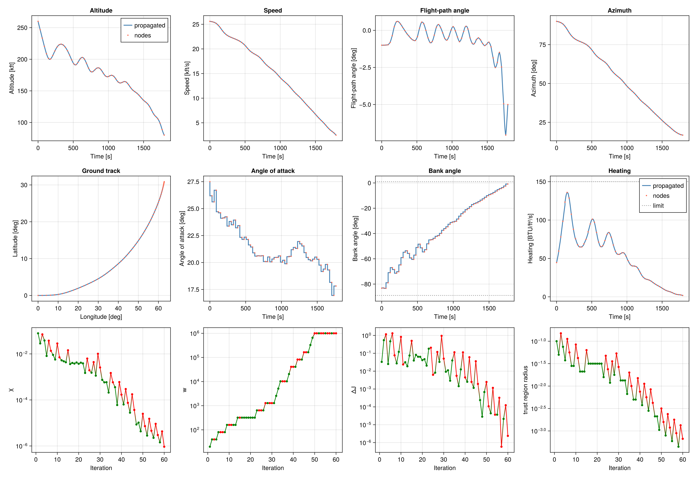

# Space Shuttle reentry

Maximum-crossrange reentry of a point-mass shuttle, using the dynamics from the [JuMP tutorial](https://jump.dev/JuMP.jl/stable/tutorials/nonlinear/space_shuttle_reentry_trajectory/) (Betts, English units).

The state is $[h, \phi, \theta, v, \gamma, \psi]$ (altitude, longitude, latitude, speed, flight-path angle, azimuth). The controls are angle of attack and bank angle. Final time is free on a uniform grid: normalized time runs over $[0, 1]$, and a dilation $\sigma = t_f / T_{\mathrm{ref}}$ scales the dynamics. States stay $O(1)$ with JuMP's scaling (altitude in units of $10^5$ ft, speed in units of $10^4$ ft/s), because SCvx* uses one trust-region bound for every variable. Plots convert back to physical units.

SCPLib integrates the nonlinear ODE with the controls held constant on each interval. Wing leading-edge heating is limited to 150 BTU/ft²/s. The reference trajectory holds the angle of attack at 21° and eases the bank from $-75^\circ$ to $-5^\circ$ over a 2000 s initial guess. A steep bank turns the heading without lofting the vehicle out of the atmosphere.

**File:** `examples/spaceshuttle/ex_scvxstar_spaceshuttle.jl`

```julia
"""Space Shuttle reentry with SCvx*

Maximum-crossrange reentry from the JuMP tutorial (Betts, English units):
https://jump.dev/JuMP.jl/stable/tutorials/nonlinear/space_shuttle_reentry_trajectory/

The state is ``[h, ϕ, θ, v, γ, ψ]`` and the controls are angle of attack and bank
angle. Final time is free. Normalized time τ ∈ [0, 1] and a uniform dilation
σ = tf / Tref give dX/dτ = σ Tref f(x, α, β), with X the O(1) scaling used by
JuMP (altitude in units of 1e5 ft, speed in units of 1e4 ft/s). SCPLib's
trust-region bounds are shared by every variable, so the solve stays in these
scaled units and plots convert back to physical units.

SCPLib integrates the nonlinear ODE with the controls held constant on each
interval. Wing leading-edge heating is limited to 70 BTU/ft²/s.

The JuMP tutorial interpolates the nodes linearly and starts the controls at
zero. That angle of attack has negative lift, and with little bank the vehicle
lofts instead of turning. The reference used here holds α = 21° and eases the
bank from -75° to -5° over the JuMP time guess of 2009 s. A steep bank turns
the heading while canceling most of the vertical lift. Integrated with a
zero-order hold, that control ends near the TAEM interface at about 32°
latitude. Its heating exceeds 70 BTU/ft²/s; the path constraint brings the
peak back under the limit.
"""

using Clarabel
using ForwardDiff
using CairoMakie
using JuMP
using LinearAlgebra
using OrdinaryDiffEq

include(joinpath(@__DIR__, "../../src/SCPLib.jl"))


# -------------------- vehicle (English units) -------------------- #
struct ShuttleParams
    m::Float64
    ρ0::Float64
    hr::Float64
    Re::Float64
    μ::Float64
    S::Float64
    a0::Float64
    a1::Float64
    b0::Float64
    b1::Float64
    b2::Float64
    c0::Float64
    c1::Float64
    c2::Float64
    c3::Float64
    H::Float64
    V::Float64
    Tref::Float64
    qU::Float64
end

const w = 203000.0
const g0 = 32.174
const H = 1e5          # ft, JuMP altitude scale
const V = 1e4          # ft/s, JuMP speed scale
const Tref = 2000.0    # s, so the dilation σ = tf / Tref is O(1)
const qU = 150.0       # BTU/ft²/s, heating limit

params = ShuttleParams(
    w / g0,
    0.002378,
    23800.0,
    20902900.0,
    0.14076539e17,
    2690.0,
    -0.20704,
    0.029244,
    0.07854,
    -0.61592e-2,
    0.621408e-3,
    1.0672181,
    -0.19213774e-1,
    0.21286289e-3,
    -0.10117249e-5,
    H,
    V,
    Tref,
    qU,
)


"""Wing leading-edge heating q = q_a q_r, BTU/ft²/s."""
function heating(h, v, α, p::ShuttleParams)
    αdeg = rad2deg(α)
    ρ = p.ρ0 * exp(-h / p.hr)
    qr = 17700 * sqrt(ρ) * (1e-4 * v)^3.07
    qa = p.c0 + p.c1 * αdeg + p.c2 * αdeg^2 + p.c3 * αdeg^3
    return qa * qr
end


function eom!(dx, x, pu, t)
    (; params, u) = pu
    h = x[1] * params.H
    θ = x[3]
    v = x[4] * params.V
    γ = x[5]
    ψ = x[6]
    α = u[1]
    β = u[2]
    σ = u[3]

    αdeg = rad2deg(α)
    ρ = params.ρ0 * exp(-h / params.hr)
    cL = params.a0 + params.a1 * αdeg
    cD = params.b0 + params.b1 * αdeg + params.b2 * αdeg^2
    qdyn = 0.5 * ρ * v^2
    L = qdyn * params.S * cL
    D = qdyn * params.S * cD
    r = params.Re + h
    g = params.μ / r^2

    s = σ * params.Tref
    dx[1] = s * v * sin(γ) / params.H
    dx[2] = s * (v / r) * cos(γ) * sin(ψ) / cos(θ)
    dx[3] = s * (v / r) * cos(γ) * cos(ψ)
    dx[4] = s * (-(D / params.m) - g * sin(γ)) / params.V
    dx[5] = s * ((L / (params.m * v)) * cos(β) + cos(γ) * (v / r - g / v))
    dx[6] = s * (
        L * sin(β) / (params.m * v * cos(γ)) +
        (v / (r * cos(θ))) * cos(γ) * sin(ψ) * sin(θ)
    )
    return
end


# -------------------- boundary conditions -------------------- #
# Entry and the terminal-area energy-management interface, in scaled units.
h_s, ϕ_s, θ_s = 2.6, deg2rad(0), deg2rad(0)
v_s, γ_s, ψ_s = 2.56, deg2rad(-1), deg2rad(90)
h_t, v_t, γ_t = 0.8, 0.25, deg2rad(-5)

θ_min, θ_max = deg2rad(-89), deg2rad(89)
γ_min, γ_max = deg2rad(-89), deg2rad(89)
v_min = 1e-4
α_min, α_max = deg2rad(-90), deg2rad(90)
β_min, β_max = deg2rad(-89), deg2rad(1)
tf_min, tf_max = 1750.0, 2250.0
tf_guess = 2000.0

x_initial = [h_s, ϕ_s, θ_s, v_s, γ_s, ψ_s]


# -------------------- objective -------------------- #
function objective(x, u)
    return -x[3, end]     # maximize final latitude
end


# -------------------- create problem -------------------- #
N = 61                              # number of nodes
nx = 6                              # [h, ϕ, θ, v, γ, ψ] / scales
nu = 3                              # [α, β, σ]
times = LinRange(0.0, 1.0, N)

# Steep bank at entry, easing off. α = 21° with this bank schedule, held for
# tf_guess, finishes near the TAEM interface with a large crossrange.
α_guess = deg2rad(21)
β_entry = deg2rad(-75)
β_final = deg2rad(-5)
σ_guess = tf_guess / Tref
u_ref = zeros(nu, N - 1)
for k in 1:N-1
    τ = times[k]
    u_ref[1, k] = α_guess
    u_ref[2, k] = (1 - τ) * β_entry + τ * β_final
    u_ref[3, k] = σ_guess
end

x_ref = zeros(nx, N)
x_ref[:, 1] = x_initial
for k in 1:N-1
    sol_k = solve(
        ODEProblem(eom!, x_ref[:, k], (times[k], times[k+1]), (; params, u = u_ref[:, k])),
        Tsit5();
        reltol = 1e-8,
        abstol = 1e-8,
    )
    x_ref[:, k+1] = sol_k.u[end]
end

let
    dx = zeros(nx)
    eom!(dx, x_initial, (; params, u = u_ref[:, 1]), 0.0)
    @assert all(isfinite, dx)
    q0 = heating(h_s * H, v_s * V, α_guess, params)
    @assert isfinite(q0)
end

# q / qU - 1 ≤ 0 at every node. The last node uses the final zero-order hold.
nh = N
function h_noncvx(cache, x, u)
    hviol = [
        heating(x[1, k] * H, x[4, k] * V, u[1, k], params) / qU - 1
        for k in 1:N-1
    ]
    hviol_N = heating(x[1, N] * H, x[4, N] * V, u[1, N-1], params) / qU - 1
    return [hviol; hviol_N]
end

prob = SCPLib.ContinuousProblem(
    Clarabel.Optimizer,
    eom!,
    params,
    objective,
    times,
    x_ref,
    u_ref;
    nh = nh,
    h_noncvx = h_noncvx,
    ode_method = Tsit5(),
    ode_reltol = 1e-7,
    ode_abstol = 1e-8,
)
set_silent(prob.model)

@constraint(prob.model, constraint_initial, prob.model[:x][:, 1] == x_initial)
@constraint(prob.model, constraint_final,
    prob.model[:x][[1, 4, 5], end] == [h_t, v_t, γ_t])

@constraint(prob.model, constraint_altitude_lb[k in 1:N], prob.model[:x][1, k] >= 0)
@constraint(prob.model, constraint_latitude_lb[k in 1:N], prob.model[:x][3, k] >= θ_min)
@constraint(prob.model, constraint_latitude_ub[k in 1:N], prob.model[:x][3, k] <= θ_max)
@constraint(prob.model, constraint_speed_lb[k in 1:N], prob.model[:x][4, k] >= v_min)
@constraint(prob.model, constraint_fpa_lb[k in 1:N], prob.model[:x][5, k] >= γ_min)
@constraint(prob.model, constraint_fpa_ub[k in 1:N], prob.model[:x][5, k] <= γ_max)
@constraint(prob.model, constraint_alpha_lb[k in 1:N-1], prob.model[:u][1, k] >= α_min)
@constraint(prob.model, constraint_alpha_ub[k in 1:N-1], prob.model[:u][1, k] <= α_max)
@constraint(prob.model, constraint_beta_lb[k in 1:N-1], prob.model[:u][2, k] >= β_min)
@constraint(prob.model, constraint_beta_ub[k in 1:N-1], prob.model[:u][2, k] <= β_max)

@constraint(prob.model, constraint_tf_lb[k in 1:N-1], prob.model[:u][3, k] >= tf_min / Tref)
@constraint(prob.model, constraint_tf_ub[k in 1:N-1], prob.model[:u][3, k] <= tf_max / Tref)
@constraint(prob.model, constraint_tf_uniform[k in 1:N-2],
    prob.model[:u][3, k] == prob.model[:u][3, k+1])


# -------------------- solve -------------------- #
# Trust region on (α, β, σ): those controls enter the dynamics nonlinearly.
# The initial bank schedule overheats. Angle of attack has to be free to rise
# and cut the heating factor, without a step so large that the linear model
# loses the turn. The latitude objective is O(1).
algo = SCPLib.SCvxStar(
    nx, N;
    nh = nh,
    w0 = 1e1,
    Δ0 = [0.1, 0.25, 0.15, 0.1, 0.1, 0.25],
    nu = nu,
    Δ0_u = [0.15, 0.2, 0.03],
    use_trustregion_control = true,
    Δ_bounds = (1e-8, 1.0),
)

solution = SCPLib.solve!(
    algo, prob, x_ref, u_ref;
    maxiter = 300,
    tol_feas = 1e-6,
    tol_opt = 1e-4,
)

sols_opt, g_dynamics_opt = SCPLib.get_trajectory(prob, solution.x, solution.u)
tf = solution.u[3, 1] * Tref


# -------------------- plot -------------------- #
function collect_propagated(sols, tf, u)
    ts = Float64[]
    hs = Float64[]
    ϕs = Float64[]
    θs = Float64[]
    vs = Float64[]
    γs = Float64[]
    ψs = Float64[]
    qs = Float64[]
    for (k, sol) in enumerate(sols)
        X = Array(sol)
        α = u[1, k]
        append!(ts, sol.t .* tf)
        append!(hs, X[1, :] .* H ./ 1e3)
        append!(ϕs, rad2deg.(X[2, :]))
        append!(θs, rad2deg.(X[3, :]))
        append!(vs, X[4, :] .* V ./ 1e3)
        append!(γs, rad2deg.(X[5, :]))
        append!(ψs, rad2deg.(X[6, :]))
        for j in axes(X, 2)
            push!(qs, heating(X[1, j] * H, X[4, j] * V, α, params))
        end
    end
    return ts, hs, ϕs, θs, vs, γs, ψs, qs
end

t_prop, h_prop, ϕ_prop, θ_prop, v_prop, γ_prop, ψ_prop, q_prop = collect_propagated(sols_opt, tf, solution.u)
t_nodes = collect(prob.times) .* tf
h_nodes = solution.x[1, :] .* H ./ 1e3
ϕ_nodes = rad2deg.(solution.x[2, :])
θ_nodes = rad2deg.(solution.x[3, :])
v_nodes = solution.x[4, :] .* V ./ 1e3
γ_nodes = rad2deg.(solution.x[5, :])
ψ_nodes = rad2deg.(solution.x[6, :])
α_nodes = rad2deg.(solution.u[1, :])
β_nodes = rad2deg.(solution.u[2, :])
q_nodes = [
    heating(solution.x[1, k] * H, solution.x[4, k] * V, solution.u[1, min(k, N - 1)], params)
    for k in 1:N
]

fig = Figure(size = (1600, 1100))

ax_h = Axis(fig[1, 1]; xlabel = "Time [s]", ylabel = "Altitude [kft]", title = "Altitude")
lines!(ax_h, t_prop, h_prop; color = :steelblue, linewidth = 2, label = "propagated")
scatter!(ax_h, t_nodes, h_nodes; color = :tomato, markersize = 4, label = "nodes")
axislegend(ax_h, position = :rt)

ax_v = Axis(fig[1, 2]; xlabel = "Time [s]", ylabel = "Speed [kft/s]", title = "Speed")
lines!(ax_v, t_prop, v_prop; color = :steelblue, linewidth = 2)
scatter!(ax_v, t_nodes, v_nodes; color = :tomato, markersize = 4)

ax_γ = Axis(fig[1, 3]; xlabel = "Time [s]", ylabel = "Flight-path angle [deg]", title = "Flight-path angle")
lines!(ax_γ, t_prop, γ_prop; color = :steelblue, linewidth = 2)
scatter!(ax_γ, t_nodes, γ_nodes; color = :tomato, markersize = 4)

ax_ψ = Axis(fig[1, 4]; xlabel = "Time [s]", ylabel = "Azimuth [deg]", title = "Azimuth")
lines!(ax_ψ, t_prop, ψ_prop; color = :steelblue, linewidth = 2)
scatter!(ax_ψ, t_nodes, ψ_nodes; color = :tomato, markersize = 4)

ax_track = Axis(fig[2, 1]; xlabel = "Longitude [deg]", ylabel = "Latitude [deg]", title = "Ground track")
lines!(ax_track, ϕ_prop, θ_prop; color = :steelblue, linewidth = 2)
scatter!(ax_track, ϕ_nodes, θ_nodes; color = :tomato, markersize = 4)

ax_α = Axis(fig[2, 2]; xlabel = "Time [s]", ylabel = "Angle of attack [deg]", title = "Angle of attack")
stairs!(ax_α, t_nodes[1:end-1], α_nodes; step = :pre, color = :steelblue, linewidth = 2)
scatter!(ax_α, t_nodes[1:end-1], α_nodes; color = :tomato, markersize = 4)

ax_β = Axis(fig[2, 3]; xlabel = "Time [s]", ylabel = "Bank angle [deg]", title = "Bank angle")
stairs!(ax_β, t_nodes[1:end-1], β_nodes; step = :pre, color = :steelblue, linewidth = 2)
scatter!(ax_β, t_nodes[1:end-1], β_nodes; color = :tomato, markersize = 4)
hlines!(ax_β, [rad2deg(β_min), rad2deg(β_max)]; color = :gray, linestyle = :dot)

ax_q = Axis(fig[2, 4]; xlabel = "Time [s]", ylabel = "Heating [BTU/ft²/s]", title = "Heating")
lines!(ax_q, t_prop, q_prop; color = :steelblue, linewidth = 2, label = "propagated")
scatter!(ax_q, t_nodes, q_nodes; color = :tomato, markersize = 4, label = "nodes")
hlines!(ax_q, [qU]; color = :gray, linestyle = :dot, label = "limit")
axislegend(ax_q, position = :rt)

colors_accept = [solution.info[:accept][i] ? :green : :red for i in eachindex(solution.info[:accept])]
ax_χ = Axis(fig[3, 1]; xlabel = "Iteration", ylabel = "χ", yscale = log10)
scatterlines!(ax_χ, eachindex(solution.info[:accept]), solution.info[:χ]; color = colors_accept, marker = :circle, markersize = 7)

ax_w = Axis(fig[3, 2]; xlabel = "Iteration", ylabel = "w", yscale = log10)
scatterlines!(ax_w, eachindex(solution.info[:accept]), solution.info[:w]; color = colors_accept, marker = :circle, markersize = 7)

ax_J = Axis(fig[3, 3]; xlabel = "Iteration", ylabel = "ΔJ", yscale = log10)
scatterlines!(ax_J, eachindex(solution.info[:accept]), abs.(solution.info[:ΔJ]); color = colors_accept, marker = :circle, markersize = 7)

ax_Δ = Axis(fig[3, 4]; xlabel = "Iteration", ylabel = "trust region radius", yscale = log10)
scatterlines!(ax_Δ, eachindex(solution.info[:accept]), [minimum(val) for val in solution.info[:Δ]]; color = colors_accept, marker = :circle, markersize = 7)

mkpath(joinpath(@__DIR__, "plots"))
save(joinpath(@__DIR__, "plots/spaceshuttle_reentry_scvxstar.png"), fig; px_per_unit = 3)
display(fig)

println("Status: $(solution.status) after $(solution.n_iter) iterations")
println("Final latitude θ = $(rad2deg(solution.x[3, end])) deg")
println("Final time tf = $(tf) s")
println("Dynamics defect ‖g‖∞ = $(norm(g_dynamics_opt, Inf))")
println("Max heating at nodes = $(maximum(q_nodes)) BTU/ft²/s")
println("Max heating along propagation = $(maximum(q_prop)) BTU/ft²/s")
println("Done!")
```


