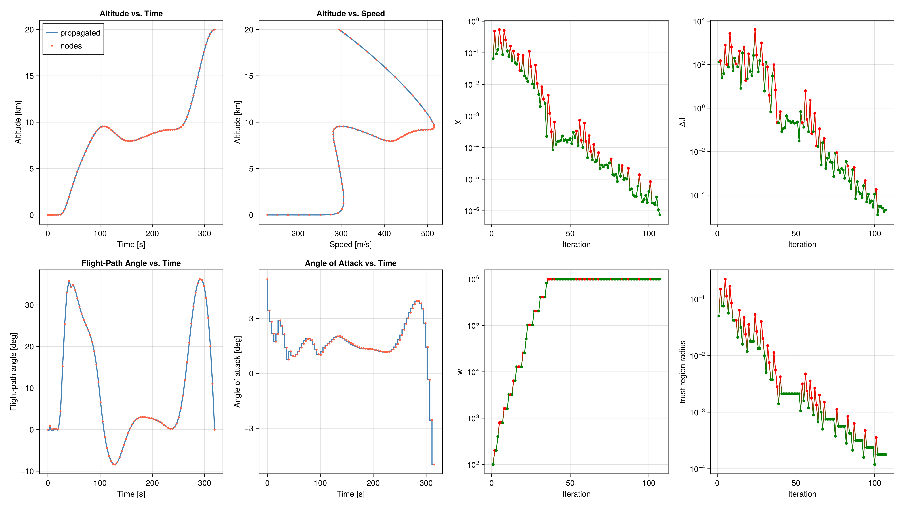
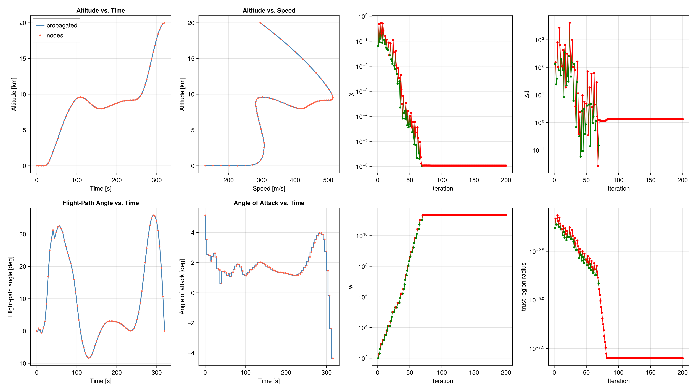

# Supersonic minimum time-to-climb

Bryson's interceptor: fly a point-mass aircraft from sea level to 20 km in minimum time. The example follows the [OpenSCvx supersonic time-to-climb problem](https://github.com/OpenSCvx/OpenSCvx/blob/main/examples/aircraft/supersonic_time_to_climb.py).

The state is $[h, v, \gamma, m]$ (altitude, speed, flight-path angle, mass) and the control is the angle of attack. Final time is free. Normalized time runs over $[0, 1]$, and a uniform dilation $\sigma = t_f / T_{\mathrm{ref}}$ scales the dynamics. States are kept $O(1)$, because SCvx* uses one trust-region bound for every variable; plots convert back to SI.

Aerodynamic data are tables. Density and the speed of sound use a natural cubic spline. The transonic coefficients $C_{D0}$, $C_{L\alpha}$, and $\eta$ use PCHIP, so a cubic does not overshoot the drag rise. Thrust is bilinear in altitude and Mach.

The optimal energy climb accelerates near sea level to about Mach 0.9, climbs, dives through the transonic drag rise, then zoom-climbs to 20 km. The minimum time is about 319 s.

**File:** `examples/supersonic/ex_scvxstar_time_to_climb.jl`

```julia
"""Supersonic minimum time-to-climb with SCvx*

Bryson's interceptor, as in the OpenSCvx example:
https://github.com/OpenSCvx/OpenSCvx/blob/main/examples/aircraft/supersonic_time_to_climb.py

The optimal energy climb accelerates near sea level to about Mach 0.9, climbs, dives
through the transonic drag rise, then zoom-climbs to 20 km. Final time is about 320 s.

Point-mass dynamics over a spherical, non-rotating Earth. The state is
``[h, v, γ, m]`` and the control is the angle of attack. Final time is free.
Normalized time τ ∈ [0, 1] and a uniform dilation σ = tf / Tref give
dX/dτ = σ Tref f(x, α), with X the O(1) scaling of the SI state. SCPLib's
trust-region bounds are shared by every variable, so the solve stays in these
scaled units and plots convert back to SI.

Atmosphere tables use a natural cubic spline. The aerodynamic coefficients use
PCHIP so the transonic peak is not overshot. Thrust is bilinear on the
altitude–Mach grid. Queries are clamped to the tables, and the active interval
is chosen from the primal value so ForwardDiff can differentiate the polynomial.
"""

using Clarabel
using ForwardDiff
using CairoMakie
using JuMP
using LinearAlgebra
using OrdinaryDiffEq

include(joinpath(@__DIR__, "../../src/SCPLib.jl"))


# -------------------- table interpolation -------------------- #
struct CubicSplineTable
    x::Vector{Float64}
    y::Vector{Float64}
    z::Vector{Float64}   # second derivatives at the knots
end

struct PCHIPTable
    x::Vector{Float64}
    y::Vector{Float64}
    d::Vector{Float64}   # Fritsch–Carlson slopes at the knots
end

struct BilinearTable
    x::Vector{Float64}
    y::Vector{Float64}
    Z::Matrix{Float64}   # Z[i, j] at (x[i], y[j])
end

"""Knot interval containing `t`. `t` must already lie inside the knots."""
function interval_index(t, knots)
    i = searchsortedlast(knots, ForwardDiff.value(t))
    return clamp(i, 1, length(knots) - 1)
end

function natural_cubic(x::AbstractVector, y::AbstractVector)
    n = length(x)
    @assert n == length(y) && n >= 2
    h = diff(x)
    δ = diff(y) ./ h
    z = zeros(n)
    m = n - 2
    if m >= 1
        dl = zeros(m)
        diag = zeros(m)
        du = zeros(m)
        rhs = zeros(m)
        for i in 2:n-1
            k = i - 1
            diag[k] = 2 * (h[i-1] + h[i])
            rhs[k] = 6 * (δ[i] - δ[i-1])
            i > 2 && (dl[k] = h[i-1])
            i < n - 1 && (du[k] = h[i])
        end
        for k in 2:m
            w = dl[k] / diag[k-1]
            diag[k] -= w * du[k-1]
            rhs[k] -= w * rhs[k-1]
        end
        rhs[m] /= diag[m]
        for k in m-1:-1:1
            rhs[k] = (rhs[k] - du[k] * rhs[k+1]) / diag[k]
        end
        z[2:n-1] = rhs
    end
    return CubicSplineTable(collect(Float64, x), collect(Float64, y), z)
end

function eval_cubic(tab::CubicSplineTable, t)
    tc = clamp(t, tab.x[1], tab.x[end])
    i = interval_index(tc, tab.x)
    h = tab.x[i+1] - tab.x[i]
    dx0 = tab.x[i+1] - tc
    dx1 = tc - tab.x[i]
    z0 = tab.z[i]
    z1 = tab.z[i+1]
    return (z0 * dx0^3 + z1 * dx1^3) / (6h) +
           (tab.y[i] / h - z0 * h / 6) * dx0 +
           (tab.y[i+1] / h - z1 * h / 6) * dx1
end

function pchip(x::AbstractVector, y::AbstractVector)
    n = length(x)
    @assert n == length(y) && n >= 2
    h = diff(x)
    δ = diff(y) ./ h
    d = zeros(n)
    if n == 2
        d .= δ[1]
        return PCHIPTable(collect(Float64, x), collect(Float64, y), d)
    end
    for k in 2:n-1
        if δ[k-1] == 0.0 || δ[k] == 0.0 || sign(δ[k-1]) != sign(δ[k])
            d[k] = 0.0
        else
            w1 = 2 * h[k] + h[k-1]
            w2 = h[k] + 2 * h[k-1]
            d[k] = (w1 + w2) / (w1 / δ[k-1] + w2 / δ[k])
        end
    end
    d[1] = ((2h[1] + h[2]) * δ[1] - h[1] * δ[2]) / (h[1] + h[2])
    if sign(d[1]) != sign(δ[1])
        d[1] = 0.0
    elseif sign(δ[1]) != sign(δ[2]) && abs(d[1]) > 3 * abs(δ[1])
        d[1] = 3 * δ[1]
    end
    d[n] = ((2h[n-1] + h[n-2]) * δ[n-1] - h[n-1] * δ[n-2]) / (h[n-1] + h[n-2])
    if sign(d[n]) != sign(δ[n-1])
        d[n] = 0.0
    elseif sign(δ[n-1]) != sign(δ[n-2]) && abs(d[n]) > 3 * abs(δ[n-1])
        d[n] = 3 * δ[n-1]
    end
    return PCHIPTable(collect(Float64, x), collect(Float64, y), d)
end

function eval_pchip(tab::PCHIPTable, t)
    tc = clamp(t, tab.x[1], tab.x[end])
    i = interval_index(tc, tab.x)
    h = tab.x[i+1] - tab.x[i]
    s = (tc - tab.x[i]) / h
    s2 = s * s
    s3 = s2 * s
    h00 = 2s3 - 3s2 + 1
    h10 = s3 - 2s2 + s
    h01 = -2s3 + 3s2
    h11 = s3 - s2
    return h00 * tab.y[i] + h10 * h * tab.d[i] + h01 * tab.y[i+1] + h11 * h * tab.d[i+1]
end

function eval_bilinear(tab::BilinearTable, x, y)
    xc = clamp(x, tab.x[1], tab.x[end])
    yc = clamp(y, tab.y[1], tab.y[end])
    i = interval_index(xc, tab.x)
    j = interval_index(yc, tab.y)
    tx = (xc - tab.x[i]) / (tab.x[i+1] - tab.x[i])
    ty = (yc - tab.y[j]) / (tab.y[j+1] - tab.y[j])
    return (1 - tx) * (1 - ty) * tab.Z[i, j] +
           tx * (1 - ty) * tab.Z[i+1, j] +
           (1 - tx) * ty * tab.Z[i, j+1] +
           tx * ty * tab.Z[i+1, j+1]
end


# -------------------- aircraft data (SI) -------------------- #
struct AircraftParams
    Re::Float64
    μ::Float64
    S::Float64
    g0::Float64
    Isp::Float64
    H::Float64
    V::Float64
    Mref::Float64
    Tref::Float64
    rho::CubicSplineTable
    sos::CubicSplineTable
    CD0::PCHIPTable
    Clalpha::PCHIPTable
    eta::PCHIPTable
    thrust::BilinearTable
end

# U.S. 1976 Standard Atmosphere, truncated to the climb envelope:
# altitude (m), density (kg/m^3), speed of sound (m/s).
atmosphere = [
    -2000.0  1.478e00  3.479e02
        0.0  1.225e00  3.403e02
     2000.0  1.007e00  3.325e02
     4000.0  8.193e-01  3.246e02
     6000.0  6.601e-01  3.165e02
     8000.0  5.258e-01  3.081e02
    10000.0  4.135e-01  2.995e02
    12000.0  3.119e-01  2.951e02
    14000.0  2.279e-01  2.951e02
    16000.0  1.665e-01  2.951e02
    18000.0  1.216e-01  2.951e02
    20000.0  8.891e-02  2.951e02
    22000.0  6.451e-02  2.964e02
    24000.0  4.694e-02  2.977e02
    26000.0  3.426e-02  2.991e02
    28000.0  2.508e-02  3.004e02
    30000.0  1.841e-02  3.017e02
    32000.0  1.355e-02  3.030e02
]
alt_table = atmosphere[:, 1]
rho_table = atmosphere[:, 2]
sos_table = atmosphere[:, 3]

# Aerodynamic coefficients vs. Mach (Bryson 1969).
mach_table = [0.0, 0.4, 0.8, 0.9, 1.0, 1.2, 1.4, 1.6, 1.8]
Clalpha_table = [3.44, 3.44, 3.44, 3.58, 4.44, 3.44, 3.01, 2.86, 2.44]
CD0_table = [0.013, 0.013, 0.013, 0.014, 0.031, 0.041, 0.039, 0.036, 0.035]
eta_table = [0.54, 0.54, 0.54, 0.75, 0.79, 0.78, 0.89, 0.93, 0.93]

# Thrust in 1000 lbf, rows Mach and columns altitude. Stored as Newtons with
# rows altitude and columns Mach.
thrust_mach = [0.0, 0.2, 0.4, 0.6, 0.8, 1.0, 1.2, 1.4, 1.6, 1.8]
thrust_alt = 304.8 .* [0.0, 5, 10, 15, 20, 25, 30, 40, 50, 70]
thrust_lbf = [
    24.2  24.0  20.3  17.3  14.5  12.2  10.2   5.7   3.4  0.1
    28.0  24.6  21.1  18.1  15.2  12.8  10.7   6.5   3.9  0.2
    28.3  25.2  21.9  18.7  15.9  13.4  11.2   7.3   4.4  0.4
    30.8  27.2  23.8  20.5  17.3  14.7  12.3   8.1   4.9  0.8
    34.5  30.3  26.6  23.2  19.8  16.8  14.1   9.4   5.6  1.1
    37.9  34.3  30.4  26.8  23.3  19.8  16.8  11.2   6.8  1.4
    36.1  38.0  34.9  31.3  27.3  23.6  20.1  13.4   8.3  1.7
    36.1  36.6  38.5  36.1  31.6  28.1  24.2  16.2  10.0  2.2
    36.1  35.2  42.1  38.7  35.7  32.0  28.1  19.3  11.9  2.9
    36.1  33.8  45.7  41.3  39.8  34.6  31.1  21.7  13.3  3.1
]
thrust_N = 4448.222 .* Matrix(transpose(thrust_lbf))

Re = 6378145.0
μ = 3.986e14
S = 49.2386
g0 = 9.80665
Isp = 1600.0

# Characteristic scales. γ and α stay in radians.
H = 20000.0
V = 300.0
mass0 = 19050.864
Mref = mass0
Tref = 100.0

params = AircraftParams(
    Re, μ, S, g0, Isp, H, V, Mref, Tref,
    natural_cubic(alt_table, rho_table),
    natural_cubic(alt_table, sos_table),
    pchip(mach_table, CD0_table),
    pchip(mach_table, Clalpha_table),
    pchip(mach_table, eta_table),
    BilinearTable(thrust_alt, thrust_mach, thrust_N),
)

# Splines reproduce linears, and the tables are recovered at the knots.
let
    xs = [0.0, 1.0, 2.0, 3.0]
    line = natural_cubic(xs, 2 .* xs .+ 1)
    @assert eval_cubic(line, 1.5) ≈ 4.0 atol = 1e-10
    ph = pchip(xs, 2 .* xs .+ 1)
    @assert eval_pchip(ph, 1.5) ≈ 4.0 atol = 1e-10
    @assert eval_cubic(params.rho, 0.0) ≈ 1.225 atol = 1e-12
    @assert eval_cubic(params.sos, 0.0) ≈ 340.3 atol = 1e-12
    @assert eval_pchip(params.CD0, 1.0) ≈ 0.031 atol = 1e-12
    @assert eval_bilinear(params.thrust, 0.0, 0.0) ≈ 24.2 * 4448.222 atol = 1e-6
    @assert eval_bilinear(params.thrust, 0.0, 0.2) ≈ 28.0 * 4448.222 atol = 1e-6
end

function eom!(dx, x, pu, t)
    (; params, u) = pu
    h = x[1] * params.H
    v = x[2] * params.V
    γ = x[3]
    m = x[4] * params.Mref
    α = u[1]
    σ = u[2]

    r = params.Re + h
    ρ = eval_cubic(params.rho, h)
    a = eval_cubic(params.sos, h)
    mach = v / a
    CD0 = eval_pchip(params.CD0, mach)
    Clα = eval_pchip(params.Clalpha, mach)
    η = eval_pchip(params.eta, mach)
    thrust = eval_bilinear(params.thrust, h, mach)

    CL = Clα * α
    CD = CD0 + η * Clα * α^2
    q = 0.5 * ρ * v^2
    lift = q * params.S * CL
    drag = q * params.S * CD

    h_dot = v * sin(γ)
    v_dot = (thrust * cos(α) - drag) / m - params.μ * sin(γ) / r^2
    γ_dot = (thrust * sin(α) + lift) / (m * v) + cos(γ) * (v / r - params.μ / (v * r^2))
    m_dot = -thrust / (params.g0 * params.Isp)

    s = σ * params.Tref
    dx[1] = s * h_dot / params.H
    dx[2] = s * v_dot / params.V
    dx[3] = s * γ_dot
    dx[4] = s * m_dot / params.Mref
    return
end


# -------------------- boundary conditions -------------------- #
alt0, altf = 0.0, 19994.88
speed0, speedf = 129.314, 295.092
fpa0, fpaf = 0.0, 0.0

h_min, h_max = 0.0, 21031.2
v_min, v_max = 5.0, 1000.0
γ_min, γ_max = deg2rad(-40.0), deg2rad(40.0)
m_min, m_max = 22.0, 20410.0
α_min, α_max = deg2rad(-45.0), deg2rad(45.0)
tf_min, tf_max = 1e-2, 800.0   # σ = 0 freezes the normalized dynamics
tf_guess = 300.0

x_initial = [alt0 / H, speed0 / V, fpa0, mass0 / Mref]
x_final = [altf / H, speedf / V, fpaf]


# -------------------- objective -------------------- #
function objective(x, u)
    return u[2, 1]     # σ = tf / Tref; uniform across the horizon
end


# -------------------- create problem -------------------- #
N = 80
nx = 4                              # [h, v, γ, m] / scales
nu = 2                              # [α, σ]
times = LinRange(0.0, 1.0, N)

# Hold altitude for the first 15% of the horizon, then climb. Other states are
# a linear interpolation from the boundary values. This is the OpenSCvx guess
# that reaches the energy-climb basin (sea-level acceleration, then a zoom).
dash_fraction = 0.15
climb = clamp.((collect(times) .- dash_fraction) ./ (1 - dash_fraction), 0.0, 1.0)
x_ref = zeros(nx, N)
x_ref[1, :] = (altf / H) .* climb
for (i, τ) in enumerate(times)
    x_ref[2, i] = (1 - τ) * (speed0 / V) + τ * (speedf / V)
    x_ref[3, i] = (1 - τ) * fpa0 + τ * fpaf
    x_ref[4, i] = mass0 / Mref
end
u_ref = [zeros(1, N - 1); (tf_guess / Tref) * ones(1, N - 1)]

prob = SCPLib.ContinuousProblem(
    Clarabel.Optimizer,
    eom!,
    params,
    objective,
    times,
    x_ref,
    u_ref;
    ode_method = Tsit5(),
    ode_reltol = 1e-7,
    ode_abstol = 1e-8,
)
set_silent(prob.model)

@constraint(prob.model, constraint_initial, prob.model[:x][:, 1] == x_initial)
@constraint(prob.model, constraint_final, prob.model[:x][1:3, end] == x_final)

@constraint(prob.model, constraint_altitude_lb[k in 1:N], prob.model[:x][1, k] >= h_min / H)
@constraint(prob.model, constraint_altitude_ub[k in 1:N], prob.model[:x][1, k] <= h_max / H)
@constraint(prob.model, constraint_speed_lb[k in 1:N], prob.model[:x][2, k] >= v_min / V)
@constraint(prob.model, constraint_speed_ub[k in 1:N], prob.model[:x][2, k] <= v_max / V)
@constraint(prob.model, constraint_fpa_lb[k in 1:N], prob.model[:x][3, k] >= γ_min)
@constraint(prob.model, constraint_fpa_ub[k in 1:N], prob.model[:x][3, k] <= γ_max)
@constraint(prob.model, constraint_mass_lb[k in 1:N], prob.model[:x][4, k] >= m_min / Mref)
@constraint(prob.model, constraint_mass_ub[k in 1:N], prob.model[:x][4, k] <= m_max / Mref)
@constraint(prob.model, constraint_alpha_lb[k in 1:N-1], prob.model[:u][1, k] >= α_min)
@constraint(prob.model, constraint_alpha_ub[k in 1:N-1], prob.model[:u][1, k] <= α_max)

@constraint(prob.model, constraint_tf_lb[k in 1:N-1], prob.model[:u][2, k] >= tf_min / Tref)
@constraint(prob.model, constraint_tf_ub[k in 1:N-1], prob.model[:u][2, k] <= tf_max / Tref)
@constraint(prob.model, constraint_tf_uniform[k in 1:N-2],
    prob.model[:u][2, k] == prob.model[:u][2, k+1])


# -------------------- solve -------------------- #
algo = SCPLib.SCvxStar(
    nx, N;
    w0 = 1e2,
    # Above about 1e6 the penalty swamps the subproblem and rejected steps no
    # longer reduce the true cost, even after the trajectory is feasible.
    w_max = 1e6,
    Δ0 = [0.2, 0.2, 0.15, 0.05],
    nu = nu,
    Δ0_u = [0.05, 0.3],
    use_trustregion_control = true,
    Δ_bounds = (1e-8, 2.0),
)

solution = SCPLib.solve!(
    algo, prob, x_ref, u_ref;
    maxiter = 200,
    tol_feas = 1e-6,
    tol_opt = 1e-4,
)

sols_opt, g_dynamics_opt = SCPLib.get_trajectory(prob, solution.x, solution.u)
tf = solution.u[2, 1] * Tref


# -------------------- plot -------------------- #
function collect_propagated(sols, tf)
    ts = Float64[]
    hs = Float64[]
    vs = Float64[]
    γs = Float64[]
    for sol in sols
        X = Array(sol)
        append!(ts, sol.t .* tf)
        append!(hs, X[1, :] .* H ./ 1e3)
        append!(vs, X[2, :] .* V)
        append!(γs, rad2deg.(X[3, :]))
    end
    return ts, hs, vs, γs
end

t_prop, h_prop, v_prop, γ_prop = collect_propagated(sols_opt, tf)
t_nodes = collect(prob.times) .* tf
h_nodes = solution.x[1, :] .* H ./ 1e3
v_nodes = solution.x[2, :] .* V
γ_nodes = rad2deg.(solution.x[3, :])
α_nodes = rad2deg.(solution.u[1, :])

fig = Figure(size = (1600, 900))

ax_h = Axis(fig[1, 1]; xlabel = "Time [s]", ylabel = "Altitude [km]", title = "Altitude vs. Time")
lines!(ax_h, t_prop, h_prop; color = :steelblue, linewidth = 2, label = "propagated")
scatter!(ax_h, t_nodes, h_nodes; color = :tomato, markersize = 5, label = "nodes")
axislegend(ax_h, position = :lt)

ax_hv = Axis(fig[1, 2]; xlabel = "Speed [m/s]", ylabel = "Altitude [km]", title = "Altitude vs. Speed")
lines!(ax_hv, v_prop, h_prop; color = :steelblue, linewidth = 2)
scatter!(ax_hv, v_nodes, h_nodes; color = :tomato, markersize = 5)

ax_γ = Axis(fig[2, 1]; xlabel = "Time [s]", ylabel = "Flight-path angle [deg]", title = "Flight-Path Angle vs. Time")
lines!(ax_γ, t_prop, γ_prop; color = :steelblue, linewidth = 2)
scatter!(ax_γ, t_nodes, γ_nodes; color = :tomato, markersize = 5)

ax_α = Axis(fig[2, 2]; xlabel = "Time [s]", ylabel = "Angle of attack [deg]", title = "Angle of Attack vs. Time")
stairs!(ax_α, t_nodes[1:end-1], α_nodes; step = :pre, color = :steelblue, linewidth = 2)
scatter!(ax_α, t_nodes[1:end-1], α_nodes; color = :tomato, markersize = 5)

colors_accept = [solution.info[:accept][i] ? :green : :red for i in eachindex(solution.info[:accept])]
ax_χ = Axis(fig[1, 3]; xlabel = "Iteration", ylabel = "χ", yscale = log10)
scatterlines!(ax_χ, eachindex(solution.info[:accept]), solution.info[:χ]; color = colors_accept, marker = :circle, markersize = 7)

ax_w = Axis(fig[2, 3]; xlabel = "Iteration", ylabel = "w", yscale = log10)
scatterlines!(ax_w, eachindex(solution.info[:accept]), solution.info[:w]; color = colors_accept, marker = :circle, markersize = 7)

ax_J = Axis(fig[1, 4]; xlabel = "Iteration", ylabel = "ΔJ", yscale = log10)
scatterlines!(ax_J, eachindex(solution.info[:accept]), abs.(solution.info[:ΔJ]); color = colors_accept, marker = :circle, markersize = 7)

ax_Δ = Axis(fig[2, 4]; xlabel = "Iteration", ylabel = "trust region radius", yscale = log10)
scatterlines!(ax_Δ, eachindex(solution.info[:accept]), [minimum(val) for val in solution.info[:Δ]]; color = colors_accept, marker = :circle, markersize = 7)

mkpath(joinpath(@__DIR__, "plots"))
save(joinpath(@__DIR__, "plots/supersonic_time_to_climb_scvxstar.png"), fig; px_per_unit = 3)
display(fig)

node_ks = (1, 16, 32, 48, 64, 80)
println("Status: $(solution.status) after $(solution.n_iter) iterations")
println("Minimum time-to-climb tf = $(tf) s")
println("Final mass = $(solution.x[4, end] * Mref) kg")
println("Dynamics defect ‖g‖∞ = $(norm(g_dynamics_opt, Inf))")
println("Altitude [km] at nodes ", join([round(max(h_nodes[k], 0.0); digits = 2) for k in node_ks], ", "))
println("Speed [m/s] at nodes ", join([round(v_nodes[k]; digits = 1) for k in node_ks], ", "))
println("Done!")
```




## Penalty weight

Be careful not to let the penalty weight grow too high. On each accepted stationary step, SCvx* doubles $w$ until it reaches `w_max`. The term added to the cost is $(w/2)\|g\|^2$. Here the scaled final time is $O(1)$, so a weight far above that scale lets a dynamics defect near $10^{-6}$ dominate the objective. The linear model then predicts a decrease that the nonlinear penalty does not deliver. Later steps are rejected, and the trust region shrinks to its lower bound and stays there. The iteration can run out of steps without meeting the optimality tolerance, even though the climb is already in hand.

The default `w_max` is $10^{16}$. On this problem that lets $w$ pass $10^{11}$:



Keep the cap near the scale of the objective. With `w_max = 1e6`, $\chi$ and $|\Delta J|$ continue to fall, and the solve reaches optimality as shown above.